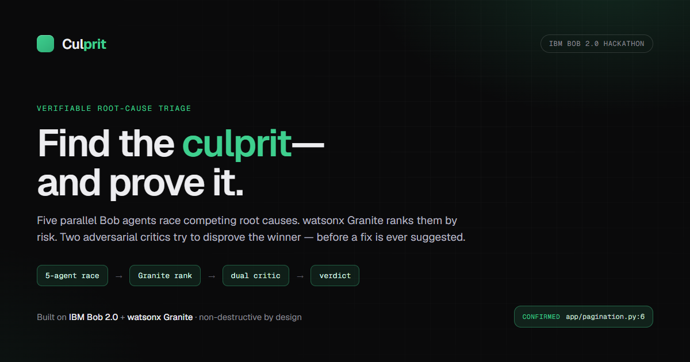
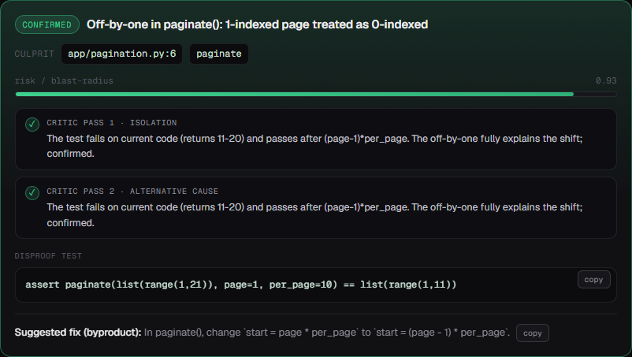
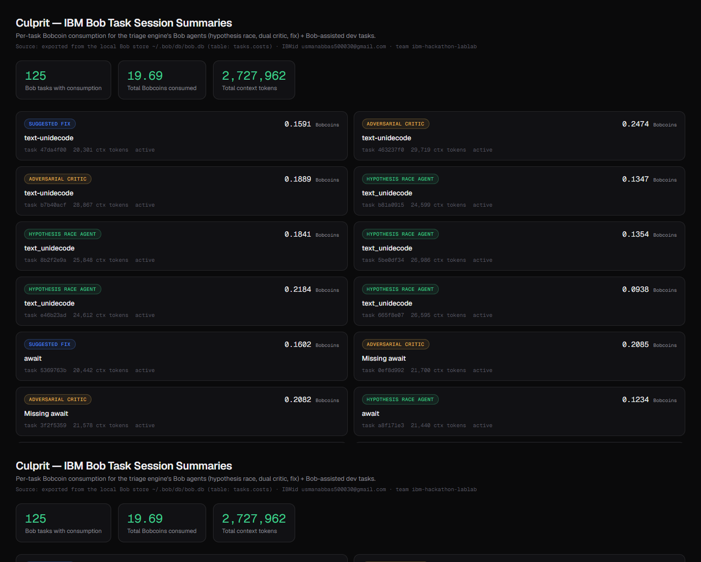

<p align="center">
  
</p>

<h1 align="center">Culprit — Verifiable Root-Cause Triage for Inherited Code</h1>

<p align="center"><em>Find the culprit — and prove it — before suggesting a fix.</em></p>

<p align="center">
  
  
  
  
  
  
</p>

Culprit turns a stack trace into a **trustworthy diagnosis**. Paste a failure and five independent
**IBM Bob** agents race competing root-cause hypotheses; **watsonx Granite** ranks them by risk; two
adversarial critics try to *disprove* the winner and write a failing test. You get a ranked,
evidence-backed verdict — culprit file/line, a disproof test, and a fix — **the fix is a byproduct,
shown only after the diagnosis survives scrutiny**. Built for the on-call engineer paged at 2 a.m.
against a service they didn't write.

> Built for the **IBM Bob 2.0 Hackathon** — improving the **debugging / incident-response** developer workflow.

## 📸 Screenshots

<p align="center"></p>
<p align="center"></p>

---

## Why it's different
- **Autonomous fixers** (Devin, Sweep, Copilot Workspace) — and Bob's own stock quick-fix / PR —
  jump straight to a patch. A fix you can't trust is worse than no fix.
- **Culprit is a triage engine, not a fix bot.** Its value is the *reasoning + verification* layer:
  competing hypotheses, model-graded ranking, and an adversarial disproof loop.
- **Proven on unfamiliar real code:** pointed at the open-source `python-slugify` repo with a real
  `ModuleNotFoundError`, Culprit correctly identified a **missing declared dependency** and *refused
  to invent a code bug*, verifying the library's logic against `pyproject.toml`. Not hallucinating is
  the hard part.
- **Non-destructive by design:** every agent runs against a throwaway copy of the repo, so the real
  working tree is never modified.

## Architecture

The pipeline is one async function, [`stream_triage()`](orchestrator/triage.py), driving four stages
and streaming Server-Sent Events to the live UI. Full write-up + diagram: [docs/ARCHITECTURE.md](docs/ARCHITECTURE.md).

1. **Parallel hypothesis race** — [`orchestrator/hypotheses.py`](orchestrator/hypotheses.py) launches
   **5 concurrent `bob run` agents**, one per angle (logic · validation · data/state · concurrency ·
   contract). Each is an independent Bob agent with full repository context.
2. **Granite risk-ranking** — [`orchestrator/granite.py`](orchestrator/granite.py) scores hypotheses
   by risk / blast-radius via **watsonx.ai Granite** (`ibm/granite-4-h-small`), with a deterministic
   heuristic fallback so a flaky call never breaks a demo.
3. **Dual adversarial critic** — [`orchestrator/critic.py`](orchestrator/critic.py) runs **two** Bob
   critics in parallel (isolation + alternative-cause); the winner survives only if neither disproves it.
4. **Diagnosis card** — culprit file/line, the disproof test, and a suggested fix (a byproduct).

That's **8 Bob calls per triage** (5 agents + 2 critics + 1 fix). Parallelism is at the process level —
each `bob run` is a genuine independent Bob agent — because Bob auto-selects its own model and its
internal subagents aren't user-forceable.

---

## Run it

Single service — FastAPI serves the UI and the SSE triage stream.

```bash
python -m venv .venv
# Windows:
.venv\Scripts\activate
# macOS/Linux:
# source .venv/bin/activate
pip install -r requirements.txt

python -m ui.server
```
Open **http://127.0.0.1:8000**, paste a failure (or click a sample), and hit **Run triage**.

For live triage on **real IBM Bob + watsonx Granite**, add your credentials to `.env` (see
[Configuration](#configuration)) and launch with `.\run_ui.ps1`. Without credentials, Culprit runs a
self-contained offline pipeline so you can still explore the full flow end-to-end.

### CLI
```bash
python run_demo.py --trace samples/sample_trace_pagination.txt
```

---

## Demo script (4 samples, one continuous flow)
1. **Pagination bug** → off-by-one in `paginate()` (`page*per_page` on a 1-indexed API).
2. **Null-email bug** → unguarded `.lower()` on an optional field.
3. **Async bug** → missing `await` returning a coroutine instead of a dict.
4. **Real repo · slugify** → a real unfamiliar library crash; Culprit finds the *missing dependency*
   and refuses to invent a code bug.

Each run: 5 agents race → Granite ranks → two critics confirm → verdict card. Same pipeline, zero config.

## How IBM Bob is used
- **As the runtime engine** — every triage is 8 headless `bob run` calls (`bob run --format json`),
  the race + dual critic + fix. Bob's full-repo context lets each agent read unfamiliar code and cite
  the offending lines.
- **As a coding assistant** — Bob agent mode authored the deployment config, the orchestrator test
  suite, and the architecture docs (see commit history).
- **Verified usage:** 125 Bob tasks · 19.69 Bobcoins across the build — see [`bob_sessions/`](bob_sessions/).

## Configuration
- `MOCK_MODE` — `0` for live IBM Bob + watsonx; defaults to a self-contained offline pipeline when no credentials are set.
- `RACE_WIDTH` — number of parallel hypothesis agents (default `5`).
- `BOB_API_KEY` — Inference-scoped key created inside the hackathon Bob instance (never committed).
- `WATSONX_API_KEY` / `WATSONX_PROJECT_ID` / `GRANITE_MODEL_ID` — for the ranking stage.
- `SANDBOX` — `1` (default): run agents against a throwaway repo copy. See [`.env.example`](.env.example).

## Verified
- `pytest` → **25 orchestrator tests** (parsing, scenario detection, ranking, end-to-end mock triage).
- Real-issue proof: [`samples/real_issue_notes.md`](samples/real_issue_notes.md).
- Bob usage evidence: [`bob_sessions/`](bob_sessions/) (Bobalytics dashboards + per-task ledger).

## Roadmap
- Wire Culprit into CI so a red build auto-opens a triage before a human looks.
- A GitHub App: comment a diagnosis + disproof test on failing PRs.
- Persist diagnoses to learn recurring root-cause patterns per repo.
- Confidence-gated auto-fix PRs — only after the dual critic clears a threshold.

<p align="center"><sub>Built on IBM Bob 2.0 + watsonx Granite · MIT License</sub></p>
